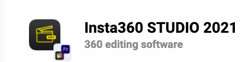

# Insta 360 Video Editing (Laptop)
In this exercise, you will practice video editing Insta 360 footage 

1. If you haven’t done so already, download the application. [Insta360 Studio Download](https://www.insta360.com/download/insta360-onex) 

_Note: make sure to select your device in the left side bar, then you can download the desktop application._

2. Open Insta360 Studio, and drag the video file to the left hand side where it says drag and drop footage here.

3. In the view window (right hand side), you can play and preview the file using different angles (tiny planet, crystal ball, natural view, default and flat).

**4. Free capture edit**
  - Select the start and end of the footage by dragging the ends to the desired cut.
  - On the top middle bar, select Free Capture (this will show the video as a normal video: not 360 with the ability to control the angles (reframing)
  - The first icon is the keyframe. Use keyframes to modify the angle and direction the camera is looking. Do this by dragging and scrolling or by manually setting angle parameters (bottom left side). 
  - The next is delete keyframe.
  - Deep track: tracks a moving object as long as it is visible
  - Timeshift: speeds up footage and Motion blur: available when timeshift is selected. 

**5. Reframing**
  - Scrub through the video and on the preview screen drag to where you want the view.
  - When the point has been chosen, click the keyframes 
  - Make sure to go through the whole clip and select the direction of the clip as it will move to that angle.
  - Play and watch to see how the keyframes look

**6. Transitions between Keyframes**
  - Click on the lines that join the keyframes, which will open the transitions settings on the bottom left side.
  - Try out various transitions.

**7. Speed**
  - Select the timeshift icon and click on the desired speed (for example: 2x)
  - Next, drag from start to finish on where this speed change will occur.
 
_Note: there can be multiple speed changes in one video footage (you can do slow motions and moving time lapses. _

**8. Deep track**
  - Click on the deep tracking icon
  - Drag your mouse to the object you want to follow

**9. Video Options:** are located on the right hand side of the Software panel
  - Flowstate stabilization: it is best to leave it on in most cases as it makes the video smooth, for this workshop leave the default but know you can change these settings.
  - Direction lock: is useful in order to have the video follow the direction the camera
  - Stitching: only applicable if you are using accessories (lens guard, waterproof case)
  - Select stitching calibration (both dynamic stitching and chromatic calibration) 

**10. Exporting** (see the final publishing activity for more inforation)
  - Select the export icon in the upper right
  - The recommended setting is 70-100mbps, but you can also change settings here.
  - For good compression, use H.265
  - The AI is best to select, as it improves colour/ noise.

**References/other resources (with visuals):**

Lesson Plans for video editing using Insta Studio (desktop software)
[lesson plan example](https://www.insta360.com/support/supportcourse?post_id=11139)
[lesson plan example](https://www.threesixtycameras.com/insta360-studio-2020-full-guide-tutorial-updated/)

_Nice work!_

[NEXT STEP: Video Recording with Smartphone](video-recording-smartphone.html){: .btn .btn-blue }
