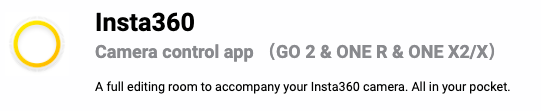

# Insta 360 Video Editing (Phone Application)
In this exercise, you will practice video editing Insta 360 footage using the application (phone software) Insta 360 One X 

<iframe width="560" height="315" src="https://www.youtube.com/embed/QkREm-78Ofo" title="YouTube video player" frameborder="0" allow="accelerometer; autoplay; clipboard-write; encrypted-media; gyroscope; picture-in-picture" allowfullscreen></iframe>

If you haven’t done so already, download the application[Insta360 Camera Control App](https://www.insta360.com/download/insta360-onex)
Note: make sure to select your device in the left side bar, then you can download the phone application

1. Open the app and connect the camera 
2. Download clip and select **album** on the lower bar
3. Next select the **video camera** icon in the top middle bar
4. Click on the clip you would like to edit
5. Select the second icon on the top (looks like a box with a line through it). This is your edit icon.

6. **Trim footage** Select the **scissors icon** in the lower bar. This is your trimming icon.
Note: you can only trim the start and end, not the middle nor joining pieces together
 - To trim the beginning: select the left side icon (with the arrow pointing to the left), and scroll your video moving your finger from right to left until you get to the desired start.
 - To trim the end: select the right side icon (with the arrow pointing to the right), and scroll backwards on the timeline (left to right), until you get to the desired end.

7. Once you have completed the trimming, click the **check mark** in the top right corner
_Note: you can always make more changes later too and come back to this._

8. **Functions **
- First icon is play/pause button
- Next is the aspect ratio (adjust the size of your shot)
- The dotted square is a screen capture
- Free capture (reframe the video)

9. Move image: to change into tiny planet mode, pinch the image and to zoom in or out (move fingers out or in). To exit tiny planet mode, slide fingers out. This is important to remember as you cannot edit in tiny planet mode. Therefore, will have to zoom back to the standard mode

10. Free capture edit: Change the angle of the camera using pivot points
- Stop the video and press the free capture icon or hold the screen
- On the pop-up screen, select **Pivot Point** 
- Repeat by playing and pausing to get desired angles 
- To delete a pivot point, select it in the video playback bar and click on the **cross icon**. 
- Next repeat step I , but select **Smart Track**
- Smart track will automatically select a predominant object that is in the center, but you can scrub through and stop where you want to add in the smart track.
- Next repeat step I, but select **View Finder**
- Press and hold the red button and move phone to whatever angle you want
- To zoom and go to tiny planet mode by moving the red button towards the right and back again (while still holding it) and moving your phone around. 
_Note rotating your body will show the whole 360 view_

11. Other options: main menu
- Effects: select a filter
- Adjust: image control (contrast, colour, brightness, saturation)
- Speed: select the speed in the bar and scroll the video to select where you want to apply this, then click the checkmark.
- You must export it before being able to see the speed changes.

12. Multiview icon (right hand side), you can select mixed views of your video.

13. Music (add music from itunes or preloaded music on the app). 

14. The 3 dots on the top right hand side, has additional options. Note: direction lock will remove all pivot points. You can reset your edits here as well. For this workshop, you do not have to change these, just know there are various settings. 

15. Exporting (icon with a square and an arrow facing diagonally beside the edit icon).
Save to camera roll or upload to desired platform 

_Nice job!_

[NEXT STEP: Publishing Video](publishing-video.html){: .btn .btn-blue }
