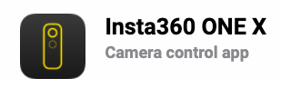

# Video recording with the smartphone app on a tripod & selfie stick
**Brittany: float image to right?** 

If you haven’t done so already, download the application. [Insta360 ONE X Download](https://www.insta360.com/download/insta360-onex){:target="_blank"}. Make sure you select your desired device (IOS, Android). This is a camera control application, the editing application is a seperate download. 

<iframe width="560" height="315" src="https://www.youtube.com/embed/8ZPmzuT46UU" title="YouTube video player" frameborder="0" allow="accelerometer; autoplay; clipboard-write; encrypted-media; gyroscope; picture-in-picture" allowfullscreen></iframe>

1. **Brittany: include images to help the learner...** Power on your 360 camera by pressing down on the bottom button (the display will turn on and become visible) 

2. Download and then connect your camera to the application following the prompts.                                                                    - Connect to the Wifi: IOS devices go to setting and select the cameras wifi (One X... for instance).
3. Open The app and select the camera settings by clicking on the bottom center camera icon (in yellow). 
     - To change it to video mode, select the video icon (on the bottom bar)
_Note the app automatically removes the selfie stick from the video_

4. Insert SD card prior to attaching to accessories (monopod, tripod, selfie stick etc..)

5. To change the quality of the video footage, select the settings button in the bottom right.
    - The default is 4K 30FPS but change that to 5.7K 30FPS (this setting records the most amount of pixels)
_Note for slow motion you can use 4k 50FPS or even more slow 3k 100FPS (not as great quality on the second one)_
    - On  the far ride in the new bar (just above settings), it says auto. Click it. We will leave it on automatic but know you can change it to manual.

6. Exporting (see the final activity for more information on exporting as well)
    - Once the video has been selected. 
    - Click the square with the arrow pointing towards the corner (third icon on the top). This is your exporting button.  
    - You can save to your camera roll or to the desired platform you wish to share your video with. 

_Note: Local is where your edits are and camera is the original footage.
Great work!_

[NEXT STEP: Editing Video with Smartphone](editing-video-smartphone.html){: .btn .btn-blue }
