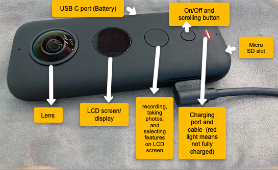

# Video Recording with a 360 Camera

### 1. Settings/Set Up. 
   - Charging camera: open up USB C port (side of camera), get the charging cable and plug it in to a usb charger. When it is complete the red light will turn off.  
_Note: you can place your camera on a soft surface (such as the case)._
   - Micro SD card: located on the bottom of the Insta camera
_Note: make sure there is no orange colour showing as that means it isn’t properly shut._
   - Cleaning (wiping the lens): make sure to use the provided cloth

### 2. Taking a Picture and Video Recording
   - When turning on your Insta360, it will open to the picture setting. To take a picture click the big button. 
   - To switch to video, click on the little button. 
   - 
### 3. Buttons and Settings 
   - On/Off and changing between video, photos and settings. (small button): scroll by clicking the button to switch between video, photo or settings. (All changes are in settings and visible on LCD screen). HOLD for 3 seconds to power on and off. 
   - To switch to settings, click the little button 3 times in a row. Once you see the settings icon. Click the big button to select it
   - Once settings is selected, you can switch from camera settings, to video, to wifi and general by clicking the big button.
   - To switch and change settings under the camera settings, click the little button and change the timer from 5 to 10 seconds for example. 
   - Under video you can modify FPS (Frame Per Seconds), the ISO, shutter
   - Menu: for starting/ending, selecting, recording or taking photos (large button)
   - LCD screen

_Note that the big button is like the enter key whereas the little button is more of a scrolling key_

Great work!

[NEXT STEP: Editing Video using Laptop](editing-video-laptop.html){: .btn .btn-blue }
